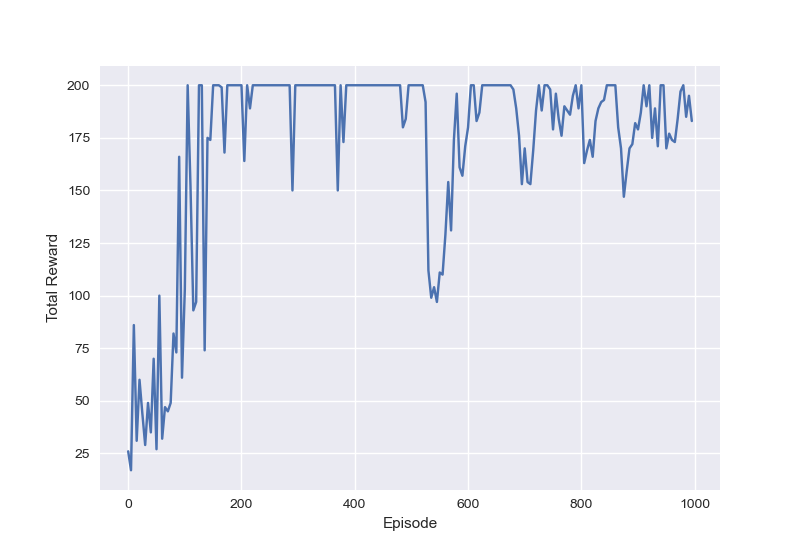

# Training A2C Agent on OpenAI Gym's Cartpole environment
This repo contains the code for an A2C Agent for the CartPole environment.
You can learn more about A2C [here](https://openai.com/blog/baselines-acktr-a2c/).

After 1000 iterations, the rewards earned looks like this:
